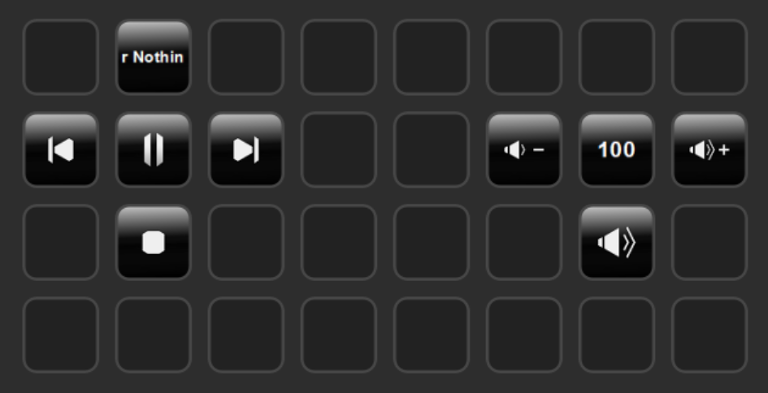

# foobar2000 Stream Deck integration

> Control foobar2000 with real-time feedback on your Elgato Stream Deck device. \
> \
> Now in the Stream Deck Store.

 

 

## Installation

Download the plugin from the [releases](https://github.com/davidborzek/streamdeck-foobar2000/releases) or from the Stream Deck Store.

For further instructions follow the [Getting started](docs/getting-started.md) page.

## Requirements

Installed foobar2000 with the [beefweb](https://www.foobar2000.org/components/view/foo_beefweb) plugin.

## Features

- Mute and unmute the volume of foobar2000
- Toggle play and pause (plays a random song when stopped)
- Display the current volume of foobar2000 on your Stream Deck.
- Control volume (up / down)
- Skip forward / backward
- Stop playback
- Display the current playback (artist & album) as ticker on a key

The status of the keys gets also updated on external controls (like the foobar2000 window).

## Contributing

1. Fork the project
2. Create your feature branch (`git checkout -b feat/fooBar`)
3. Commit your changes (`git commit -am 'feat: Add some fooBar'`)
4. Push to the branch (`git push origin feature/fooBar`)
5. Create a new Pull Request

## Credits

- [beefweb](https://github.com/hyperblast/beefweb) plugin to control foobar2000
